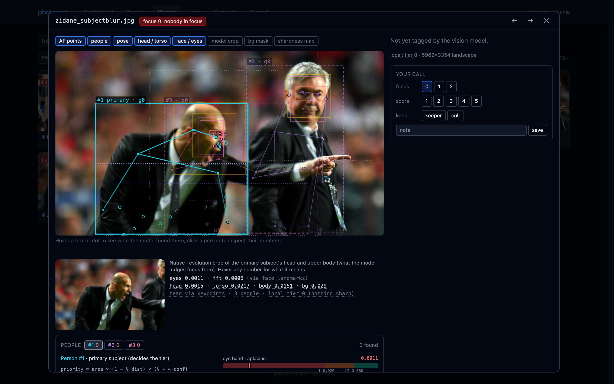
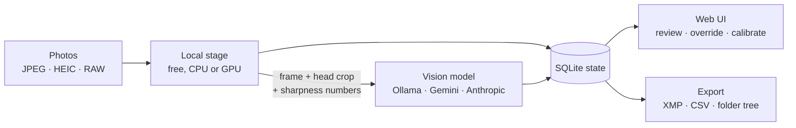
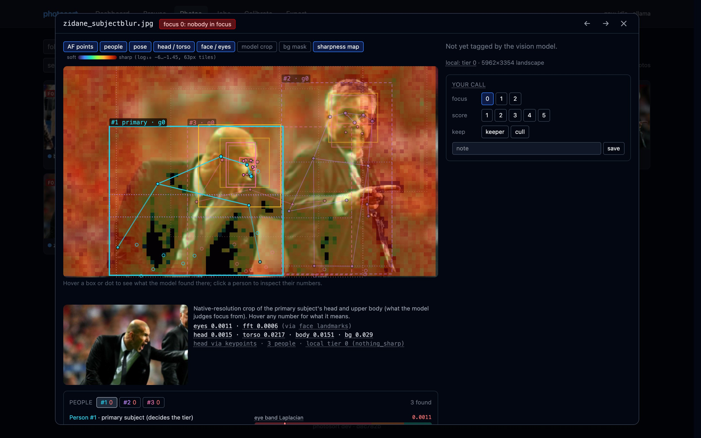
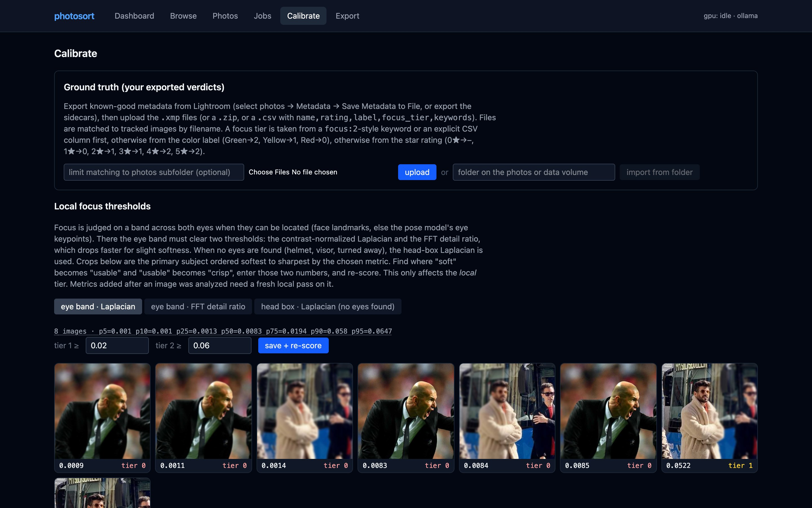
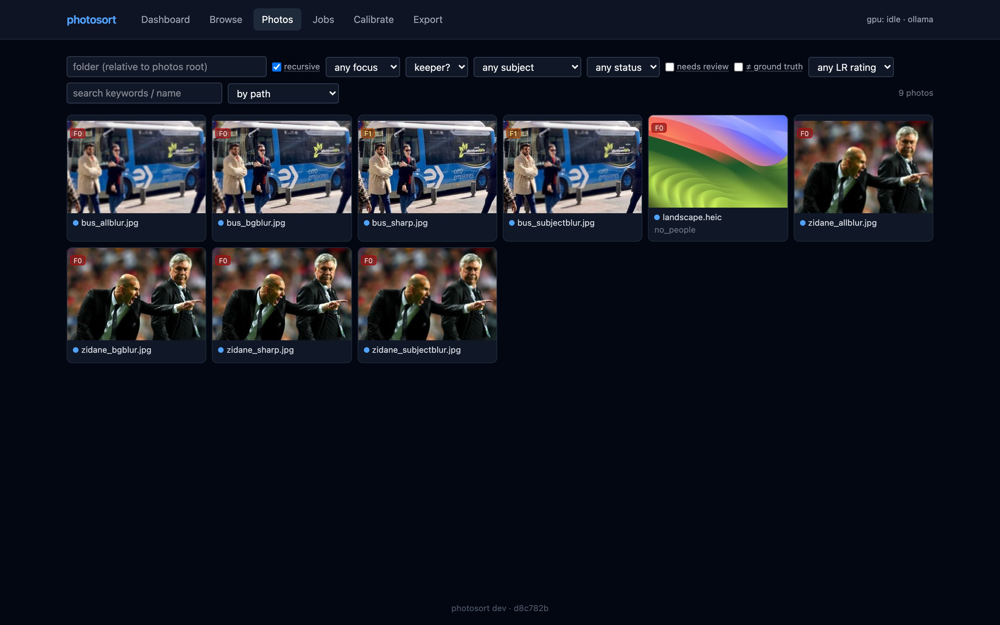

# photosort

[](https://github.com/mononendev/photosort/actions/workflows/ci.yml)


[](LICENSE)

**Cull and tag thousands of event photos without looking at each one.** photosort finds the people in
every frame, measures whether the eyes of the main subject are actually sharp, and has a vision model
describe what's in the frame. Then it hands you a sorted tree, Lightroom-ready XMP sidecars, and a web UI
to check its work.

It was built for a ~20,000-frame event shoot: 20 MP bodies, fast lenses near wide open, riders in helmets.
At f/1.4-f/2 focus varies across a body, so the question that matters most is "did focus land on the eyes?"



## What it does

- **Focus tiers from pixels, not vibes.** A pose model finds each person; the eye band of the primary
  subject is scored at native resolution with two sharpness metrics. Every frame lands in tier
  **0** (nobody in focus), **1** (partly), or **2** (sharp).
- **Vision-model tagging.** Subject, composition, action, keywords, adjectives, a caption, editor-style
  remarks, a 1-5 score and a keeper flag, as schema-constrained JSON. Runs free on a local GPU with
  Ollama, or through the Gemini and Anthropic batch APIs.
- **Two opinions, flagged disagreements.** When the local focus tier and the model's tier differ, the
  frame goes into a review queue instead of being silently trusted.
- **Show the math.** The detail view overlays detections, keypoints, the eye band, and a per-tile
  sharpness heat map, and every number has a tooltip that explains it.
- **Calibrate against your own picks.** Upload XMP sidecars you already rated in Lightroom and the
  Calibrate page suggests thresholds and shows how often photosort agrees with you.
- **Export where you already work.** XMP sidecars (keywords, caption, rating, `PhotoSort|…` hierarchy),
  CSV/JSONL, and a `focus_N/<subject>/<composition>/` folder tree.
- **Reads what cameras write.** JPEG, HEIC, and RAW (CR2, NEF, ARW, …) via the embedded preview. EXIF
  aperture and shutter speed feed a depth-of-field / motion-blur prior, and on Canon bodies the AF points
  from the maker notes pick which person the photographer meant as the subject.

## How it works



1. **Local stage** (no API cost). [YOLO11n-pose](https://docs.ultralytics.com/tasks/pose/) finds people
   and head keypoints; it works under helmets. OpenCV's YuNet face detector locates the eyes inside each
   head box, with the pose eye keypoints as a fallback. A band across both eyes is scored with a
   contrast-normalized Laplacian and an FFT high-frequency energy ratio (the ratio falls faster for slight
   defocus). When no eyes are visible (visor, turned away), the head box decides. The stage also produces a
   1568 px frame and a native-resolution head crop for the vision model.
2. **Vision model.** Gets the frame, the crop, the measured sharpness, and an EXIF summary, and returns
   structured JSON. The default is `qwen3-vl:4b-instruct` on Ollama, which fits an 8 GB card.
3. **Review and export.** Browse results, override anything, then export.

The focus scoring, including how the thresholds work and why there are two metrics, is written up in
[docs/FOCUS.md](docs/FOCUS.md).

<table>
  <tr>
    <td width="50%"><br><sub><b>Sharpness map.</b> Per-tile Laplacian, soft (red) to sharp (green). Here the background is sharper than the subject, so the frame is tier 0.</sub></td>
    <td width="50%"><br><sub><b>Calibrate.</b> Primary subjects ordered softest to sharpest by the chosen metric, with ground-truth import from Lightroom XMP.</sub></td>
  </tr>
  <tr>
    <td colspan="2"><br><sub><b>Photos.</b> Filter by focus tier, subject, keeper, review status, keywords or Lightroom rating.</sub></td>
  </tr>
</table>

> The screenshots use the synthetic images in [`dev-data/`](dev-data). They are 4.6x upscaled, so nothing
> in them is sharp at native resolution and most land in tier 0 with the default thresholds.

## Quick start

### Prerequisites

| | Version | Needed for |
|---|---|---|
| Python | 3.10+ | everything |
| Node + pnpm | Node 22, pnpm 9 | the web UI |
| [Ollama](https://ollama.com) | 0.34+ | local vision model (optional) |
| exiftool | any | CR3 metadata (optional) |

A GPU is optional. On an M1 Pro the local stage runs ~0.6 s/image; `--device` picks `cuda`, `mps` or `cpu`
and defaults to whatever is available.

### Install

```bash
git clone https://github.com/mononendev/photosort.git
cd photosort
python3 -m venv .venv
. .venv/bin/activate
pip install -e . pytest
(cd web && pnpm install)
```

Model weights download on first use into the current directory, or into `$PHOTOSORT_MODELS` if set:
`yolo11n-pose.pt` (6 MB) from Ultralytics and `face_detection_yunet_2023mar.onnx` (230 KB) from
opencv_zoo.

### Run

Two terminals, API on `:8080` and Vite on `:5173` with hot reload:

```bash
make dev      # API + job worker against ./dev-data, state in ./photosort_work
```

```bash
make web      # UI at http://localhost:5173, proxies /api and /media to :8080
```

Open http://localhost:5173, go to **Browse**, select some files, and click **Process selected**. Point it
at your own photos with `--photos`:

```bash
python -m photosort --workdir photosort_work web --photos ~/Pictures/event --port 8080
```

Or run a single process: build the UI once with `(cd web && pnpm build)` and the API serves `web/dist`
itself on `:8080`.

### Add a vision model

Without one, the UI still runs the local stage (turn off "run vision model" when processing). To tag
locally with Ollama:

```bash
ollama pull qwen3-vl:4b-instruct
```

```bash
OLLAMA_HOST=http://localhost:11434 make dev
```

Use the `-instruct` tag. The bare `qwen3-vl:4b` is the thinking variant and returns empty output under a
JSON schema. For the cloud batch backends, set `GEMINI_API_KEY` or `ANTHROPIC_API_KEY` and use the CLI (see
below); `photosort estimate` prints a cost table first.

## Command line

The same pipeline runs without the UI, which is how the cloud batch backends are driven:

```bash
photosort scan ~/Pictures/event              # register files
photosort local --workers 8                  # stage 1: detect, score, crop
photosort calibrate --metric eye             # sharpness distribution + contact sheet
photosort estimate                           # cost of stage 2 across models
photosort submit --backend gemini --sample 200
photosort poll --wait                        # fetch batch results
photosort sort ~/Pictures/event-sorted       # folder tree + CSV/JSONL + XMP sidecars
```

Every command and flag is covered in [docs/CLI.md](docs/CLI.md).

## Configuration

Settings live in `<workdir>/config.json`, written with defaults on first run; the defaults and a comment
for each are in [`photosort/config.py`](photosort/config.py). The ones you're most likely to touch:

| Key | Default | What it does |
|---|---|---|
| `focus.eye_tier2_min` / `eye_tier1_min` | 0.06 / 0.02 | Eye-band Laplacian thresholds for tier 2 / tier 1 |
| `focus.hf_tier2_min` / `hf_tier1_min` | 0.03 / 0.01 | Eye-band FFT ratio thresholds (both metrics must pass) |
| `focus.tier2_min` / `tier1_min` | 0.03 / 0.01 | Head-box thresholds when no eyes are found |
| `backend` / `model` | `ollama` / backend default | Vision backend and model |
| `exif.crop_factor` | 1.0 | Set to 1.5/1.6 for APS-C bodies without a 35 mm-equivalent tag |
| `focus_source` | `vlm` | Which tier sorting uses: `vlm`, `local`, or `strict` (the lower of both) |

The focus thresholds that ship are placeholders. Set real ones from your own camera on the Calibrate page,
or with `photosort calibrate`, and then re-score; no re-analysis is needed.

Environment variables: `PHOTOSORT_WORKDIR`, `PHOTOSORT_PHOTOS`, `PHOTOSORT_MODELS`, `PORT`, `OLLAMA_HOST`,
`GEMINI_API_KEY`, `ANTHROPIC_API_KEY`.

## Build

```bash
make test                   # pytest + web typecheck, build, and lint
(cd web && pnpm build)      # static UI into web/dist
```

Container images, built locally:

```bash
docker build -f docker/api.Dockerfile --target production -t photosort-api .
docker build -f docker/ui.Dockerfile --target production -t photosort-ui .
```

Run them together; the UI's nginx proxies `/api` and `/media` to a host named `photosort-api`:

```bash
docker network create photosort
docker run -d --name photosort-api --network photosort \
  -v ~/Pictures/event:/photos:ro -v "$PWD/photosort_data:/data" \
  -e OLLAMA_HOST=http://host.docker.internal:11434 photosort-api
docker run -d --name photosort-ui --network photosort -p 8080:80 photosort-ui
```

The UI is then at http://localhost:8080. The API runs as uid 568, so on Linux `photosort_data/` must be
writable by it (`sudo chown 568:568 photosort_data`).

The API image uses CPU PyTorch on purpose: the CUDA wheels push it to ~5 GB, and detection is a small cost
next to the vision model. Model weights are baked in, so the only network access it needs is to Ollama.
`make push` builds both images for `linux/amd64` on a remote buildx builder and pushes them.

## Deploy

The reference deployment is a Helm chart in [`.ci/chart`](.ci/chart) on a homelab k3s cluster: one API
pod sharing a Quadro RTX 4000 with Ollama, photos mounted read-only, state on a persistent volume. CI
(`.github/workflows/ci.yml`) tests, builds, pushes to a private registry, and runs `helm upgrade` on the
default branch. The registry, runners, and volume names are specific to that cluster; see
[docs/DEPLOY.md](docs/DEPLOY.md) for what to change.

## Performance

Measured on the real thing:

| Step | Throughput |
|---|---|
| Local stage, M1 Pro | ~0.6 s/image single-threaded |
| Local stage, in-cluster, CPU PyTorch, CR2 embedded previews | ~0.5 img/s |
| `qwen3-vl:4b-instruct` on a Quadro RTX 4000 (8 GB) | ~7 s/image warm, ~10 s cold |
| Gemini 3.5 Flash-Lite, batch | ~$14 per 20k images |

On a first real run of 200 CR2 files, the local and model focus tiers agreed on 193. At ~10 s/image the
local model takes about two days for 20k frames, so "skip nobody-in-focus" is worth turning on. Concurrency
doesn't help on one GPU: grammar-constrained decoding serializes. Provider pricing for other models is in
[docs/DEVLOG.md](docs/DEVLOG.md#provider-comparison-batch-pricing-50-off-frame--crop--350-output-tokens).

## Limitations

- **Thresholds need calibrating per camera.** The defaults are placeholders until you feed in your own
  verdicts.
- **The 4B model's subject labels are shaky** on candid shots (a lone walker tagged `crowd_spectators`).
  Treat subject and composition as hints; keywords and remarks are usable. Focus is carried by the local
  stage either way.
- **One API replica.** The job runner and SQLite state assume a single process.

## Repository layout

```
photosort/          Python package
  local.py            stage 1: pose detection, eye band, sharpness metrics, focus tier
  backends/           Ollama, Gemini and Anthropic vision backends
  pipeline.py         job runner used by the web API
  web/app.py          FastAPI app
  sort.py sidecar.py  folder tree and XMP export
  truth.py            ground-truth import for calibration
  cli.py              the photosort command
web/                React 19 + Vite + Tailwind 4 UI
tests/              pytest, no GPU or network needed
dev-data/           synthetic 20 MP test images (sharp, subject blur, background blur, all blur)
docker/             API and UI Dockerfiles, nginx config
.ci/chart/          Helm chart
docs/               CLI, focus scoring, deployment, dev log
```

## Documentation

- [docs/CLI.md](docs/CLI.md): every command, the batch workflow, and running pieces in a cluster
- [docs/FOCUS.md](docs/FOCUS.md): how focus is measured and how to calibrate it
- [docs/DEPLOY.md](docs/DEPLOY.md): Kubernetes deployment
- [docs/DEVLOG.md](docs/DEVLOG.md): design decisions, provider research, and measurements as they happened

## License

[GNU AGPL-3.0](LICENSE). If you run a modified version as a network service, you must offer its source to
its users. The pose model comes from [Ultralytics](https://github.com/ultralytics/ultralytics), which is
AGPL-3.0 as well.
