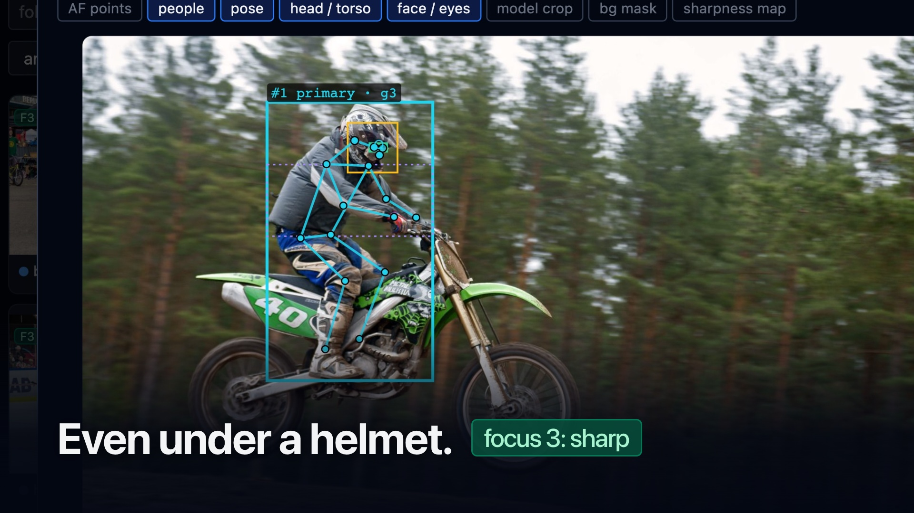
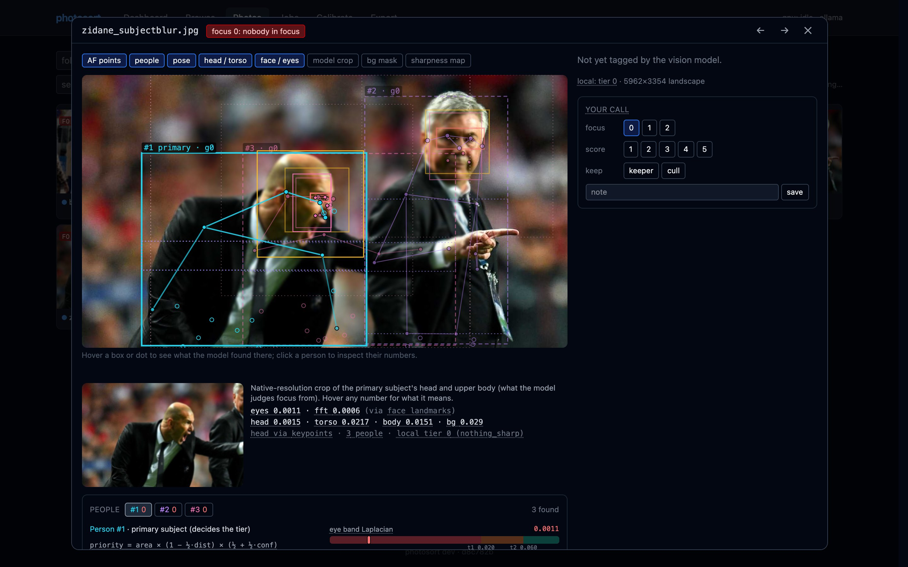
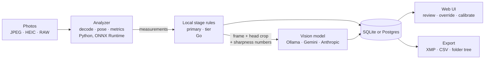
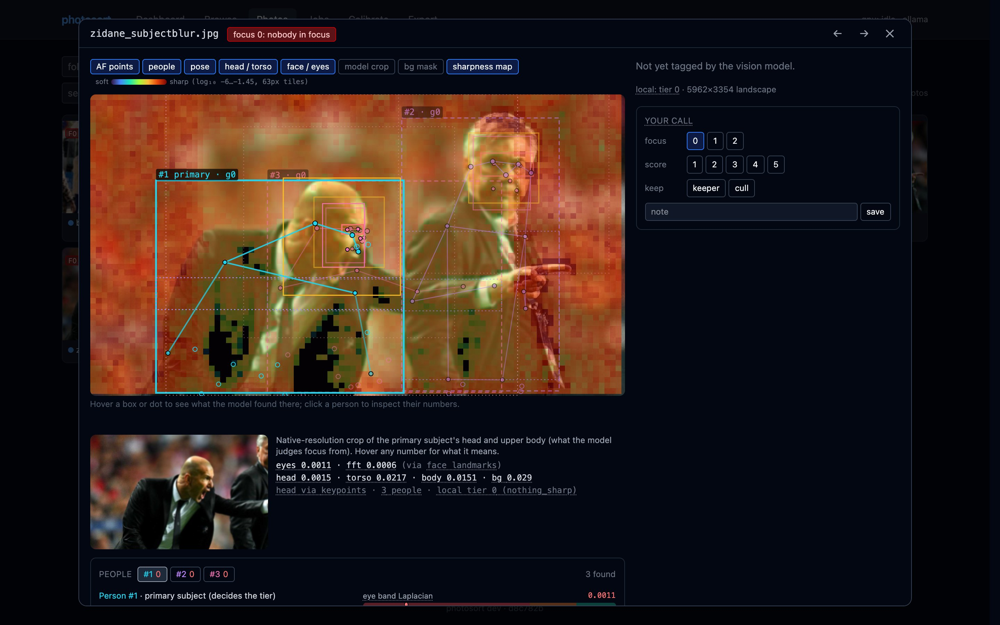
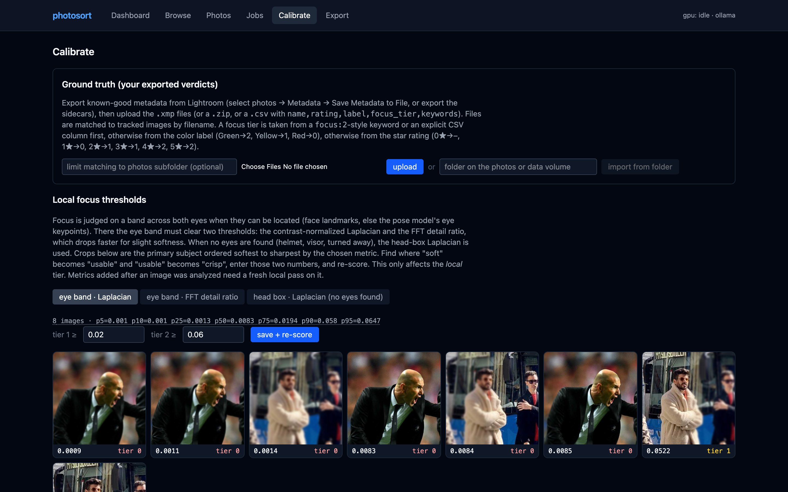
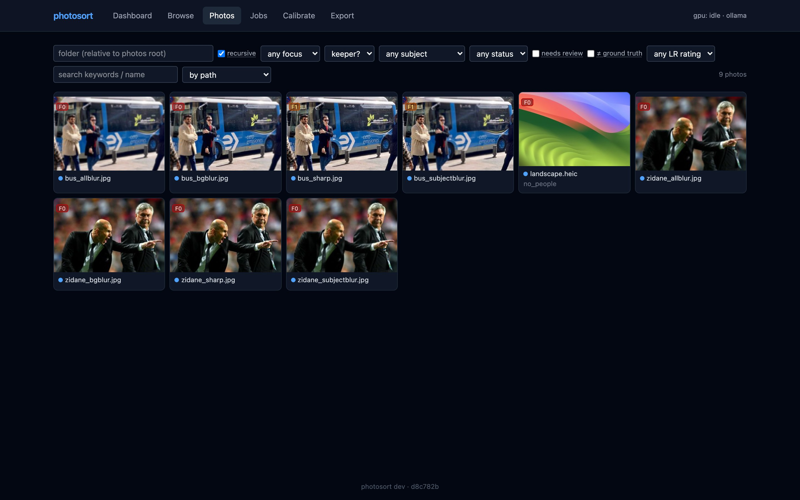

# photosort

[](https://github.com/mononendev/photosort/actions/workflows/ci.yml)


[](LICENSE)

**Cull and tag thousands of event photos without looking at each one.** photosort finds the people in
every frame, measures whether the eyes of the main subject are actually sharp, and has a vision model
describe what's in the frame. Then it hands you a sorted tree, Lightroom-ready XMP sidecars, and a web UI
to check its work.

It was built for a ~20,000-frame event shoot: 20 MP bodies, fast lenses near wide open, riders in helmets.
At f/1.4-f/2 focus varies across a body, so the question that matters most is "did focus land on the eyes?"

<a href="docs/media/photosort-demo.mp4"></a>

<sub>▶ <a href="docs/media/photosort-demo.mp4">Watch the 21-second demo</a> (MP4, 16 MB, with sound). Video: CC BY-SA 4.0, <a href="docs/media/CREDITS.md">photo credits</a>.</sub>



## What it does

- **Focus tiers from pixels, not vibes.** A pose model finds each person; the eye band of the primary
  subject is scored at native resolution with two sharpness metrics. Every frame lands in tier
  **0** (missed), **1** (soft), **2** (slightly soft), or **3** (sharp).
- **Vision-model tagging.** Subject, composition, action, keywords, adjectives, a caption, editor-style
  remarks, a 1-5 score and a keeper flag, as schema-constrained JSON. Runs free on a local GPU with
  Ollama, or through the Gemini and Anthropic batch APIs.
- **Two opinions, flagged disagreements.** When the local focus tier and the model's tier differ, the
  frame goes into a review queue instead of being silently trusted.
- **Show the math.** The detail view overlays detections, keypoints, the eye band, and a per-tile
  sharpness heat map, and every number has a tooltip that explains it.
- **Calibrate against your own picks.** Upload XMP sidecars you already rated in Lightroom and the
  Calibrate page suggests thresholds and shows how often photosort agrees with you.
- **Export where you already work.** XMP sidecars (keywords, caption, rating, `PhotoSort|…` hierarchy),
  CSV/JSONL, and a `focus_N/<subject>/<composition>/` folder tree.
- **Reads what cameras write.** JPEG, HEIC, and RAW (CR2, NEF, ARW, …) via the embedded preview. EXIF
  aperture and shutter speed feed a depth-of-field / motion-blur prior, ISO (times any exposure lift) a noise
  prior, and on Canon bodies the AF points
  from the maker notes pick which person the photographer meant as the subject.

## How it works


```mermaid
flowchart LR
    A[Photos<br/>JPEG · HEIC · RAW] --> AN[Analyzer<br/>decode · pose · metrics<br/>Python, ONNX Runtime]
    AN -->|measurements| B[Local stage rules<br/>primary · tier<br/>Go]
    B -->|frame + head crop<br/>+ sharpness numbers| C[Vision model<br/>Ollama · Gemini · Anthropic]
    B --> D[(SQLite or Postgres)]
    C --> D
    D --> E[Web UI<br/>review · override · calibrate]
    D --> F[Export<br/>XMP · CSV · folder tree]
```

The backend is one Go binary, `photosort`: the HTTP API, the job runner, EXIF and AF-point reading, the tier
rules, the vision backends, export, and the CLI. Everything that touches pixels (decoding, exposure lift, pose
detection, the focus metrics, face landmarks, the frame, thumbnail and crop JPEGs) runs in a small Python
service, the analyzer ([`analyzer/`](analyzer)), which in the cluster scales out as a pool of pods. The split is there because the
calibrated thresholds depend on OpenCV's and Pillow's exact numerics; `photosort` starts the analyzer itself
unless `$PHOTOSORT_ANALYZER` points at one already running.

1. **Local stage** (no API cost). A pose model finds people and head keypoints; it works under helmets.
   The model is a choice: YOLO11 and [YOLO26](https://docs.ultralytics.com/tasks/pose/) pose (n to x) or
   MMPose's RTMO (s, m, l), all run on ONNX Runtime. New installs default to `yolo26s-pose`; `yolo11n-pose`
   reproduces the model earlier versions used exactly, so existing calibrations carry over. OpenCV's YuNet
   face detector locates the eyes inside each head box, with the pose eye keypoints as a fallback. A band
   across both eyes is scored with a contrast-normalized Laplacian and an FFT high-frequency energy ratio
   (the ratio falls faster for slight defocus). When no eyes are visible (visor, turned away), the head box
   decides. The stage also produces a 1568 px frame and a native-resolution head crop for the vision model.
2. **Vision model.** Gets the frame, the crop, the measured sharpness, and an EXIF summary, and returns
   structured JSON. The default is `qwen3-vl:4b-instruct` on Ollama, which fits an 8 GB card.
3. **Review and export.** Browse results, override anything, then export. To cull, open a photo and rate it
   with `q` `w` `e` `r` `t` (or the bar at the bottom on a phone): 0-3 are the focus tiers (missed, soft,
   slightly soft, sharp), and the fifth (blue ★) marks a banger, which only you can give. Rating marks the photo
   reviewed and steps to the next one. Re-running jobs never changes a rating. Exports carry it as the color
   label (red, orange, yellow, green, blue; Lightroom has no stock orange, so it shows as a custom label), and
   bangers get their own `bangers/` folder in the tree.

The focus scoring, including how the thresholds work and why there are two metrics, is written up in
[docs/FOCUS.md](docs/FOCUS.md).

<table>
  <tr>
    <td width="50%"><br><sub><b>Sharpness map.</b> Per-tile Laplacian, soft (red) to sharp (green). Here the background is sharper than the subject, so the frame is tier 0.</sub></td>
    <td width="50%"><br><sub><b>Calibrate.</b> Primary subjects ordered softest to sharpest by the chosen metric, with ground-truth import from Lightroom XMP.</sub></td>
  </tr>
  <tr>
    <td colspan="2"><br><sub><b>Photos.</b> Filter by focus tier, subject, keeper, review status, keywords or Lightroom rating.</sub></td>
  </tr>
</table>

> The screenshots use the synthetic images in [`dev-data/`](dev-data). They are 4.6x upscaled, so nothing
> in them is sharp at native resolution and most land in tier 0 with the default thresholds.

## Quick start

### Prerequisites

| | Version | Needed for |
|---|---|---|
| Go | 1.27 | the backend and CLI |
| [uv](https://docs.astral.sh/uv/) | any recent | the analyzer (it installs Python 3.13 itself if needed) |
| Node + pnpm | Node 24 LTS, pnpm 12 (via corepack) | the web UI |
| [Ollama](https://ollama.com) | 0.34+ | local vision model (optional) |
| exiftool | any | Canon AF points from CR3 and odd maker notes (optional) |

A GPU is optional. Pose detection runs on ONNX Runtime's CPU provider by default (~0.1-0.25 s/image on an
M-series laptop for the small models, see [Performance](#performance)); an `onnxruntime-gpu` install uses CUDA
when it's there.

### Install

```bash
git clone https://github.com/mononendev/photosort.git
cd photosort
make analyzer                   # the analyzer's venv (uv sync in analyzer/)
(cd web && corepack pnpm install)
make models                     # pose models into ./models/pose (default: yolo26s-pose)
```

`make models` converts the YOLO models from Ultralytics' `.pt` files to ONNX, so it pulls in the analyzer's
`ultralytics` extra (PyTorch, a large one-time download) and needs network access. Pick others
with `make models NAMES="yolo11n-pose rtmo-m"`; `go run ./cmd/photosort models list` shows what exists and what
is installed. A workdir from an older version is configured for `yolo11n-pose`, so install that one for it. The analyzer image skips this step: it ships with `yolo11n-pose`, `yolo26s-pose` and `rtmo-s`
already converted. The YuNet face model (`face_detection_yunet_2023mar.onnx`, 230 KB, from opencv_zoo)
downloads into `$PHOTOSORT_MODELS` on first use. The Makefile sets `PHOTOSORT_MODELS` to `./models`.

### Run

Two terminals, API on `:8080` and Vite on `:5173` with hot reload:

```bash
make dev      # API + job runner against ./dev-data, state in ./photosort_work; starts the analyzer itself
```

```bash
make web      # UI at http://localhost:5173, proxies /api and /media to :8080
```

Open http://localhost:5173, go to **Browse**, select some files, and click **Process selected**. Point it
at your own photos with `PHOTOS`:

```bash
make dev PHOTOS=~/Pictures/event
```

or run the binary directly (outside `make`, set `PHOTOSORT_MODELS` yourself):

```bash
PHOTOSORT_MODELS=$PWD/models go run ./cmd/photosort --workdir photosort_work web --photos ~/Pictures/event --port 8080
```

`photosort web` starts the analyzer as a child process from `./analyzer` (`uv run`, on 127.0.0.1:8090) and
stops it on exit. To run it yourself instead, start `uv run python -m photosort_analyzer` in `analyzer/` and
set `PHOTOSORT_ANALYZER=http://127.0.0.1:8090`.

Or run a single process: build the UI once with `(cd web && corepack pnpm build)` and the API serves
`web/dist` itself on `:8080`.

### Add a vision model

Without one, the UI still runs the local stage (turn off "run vision model" when processing). To tag
locally with Ollama:

```bash
ollama pull qwen3-vl:4b-instruct
```

```bash
OLLAMA_HOST=http://localhost:11434 make dev
```

Use the `-instruct` tag. The bare `qwen3-vl:4b` is the thinking variant and returns empty output under a
JSON schema. For the cloud batch backends, set `GEMINI_API_KEY` or `ANTHROPIC_API_KEY` and use the CLI (see
below); `photosort estimate` prints a cost table first.

## Command line

The same pipeline runs without the UI, which is how the cloud batch backends are driven. `make bin` builds
`bin/photosort` (or use `go run ./cmd/photosort`):

```bash
photosort scan ~/Pictures/event              # register files
photosort local --workers 8                  # stage 1: detect, score, crop
photosort calibrate --metric eye             # sharpness distribution + contact sheet
photosort estimate                           # cost of stage 2 across models
photosort submit --backend gemini --sample 200
photosort poll --wait                        # fetch batch results
photosort sort ~/Pictures/event-sorted       # folder tree + CSV/JSONL + XMP sidecars
```

Every command and flag is covered in [docs/CLI.md](docs/CLI.md).

## Configuration

Settings live in `<workdir>/config.json`, written with defaults on first run; the defaults and a comment
for each are in `Defaults()` in [`internal/config/config.go`](internal/config/config.go). The ones you're most
likely to touch:

| Key | Default | What it does |
|---|---|---|
| `detect_model` | `yolo26s-pose` | Pose model: `yolo11{n,s,m,l,x}-pose`, `yolo26{n,s,m,l,x}-pose`, `rtmo-{s,m,l}`. A config from an older version says `yolo11n-pose.pt`, which runs as its ONNX export with the same numbers |
| `detect_conf` | 0.25 | Least detector confidence for a person to count |
| `detect_iou` | 0.7 | NMS overlap for the YOLO11 family (YOLO26 and RTMO are NMS-free) |
| `focus.eye_tier3_min` / `eye_tier2_min` / `eye_tier1_min` | 0.06 / 0.035 / 0.02 | Eye-band Laplacian thresholds for tier 3 / 2 / 1 |
| `focus.hf_tier3_min` / `hf_tier2_min` / `hf_tier1_min` | 0.03 / 0.017 / 0.01 | Eye-band FFT ratio thresholds (both metrics must pass) |
| `focus.tier3_min` / `tier2_min` / `tier1_min` | 0.03 / 0.017 / 0.01 | Head-box thresholds when no eyes are found |
| `backend` / `model` | `ollama` / backend default | Vision backend and model |
| `exif.crop_factor` | 1.0 | Set to 1.5/1.6 for APS-C bodies without a 35 mm-equivalent tag |
| `focus_source` | `vlm` | Which tier sorting uses: `vlm`, `local`, or `strict` (the lower of both) |

The focus thresholds that ship are placeholders. Set real ones from your own camera on the Calibrate page,
or with `photosort calibrate`, and then re-score; no re-analysis is needed. Changing the pose model does need
one: the Calibrate page's **Pose model** panel sets `detect_model`, `detect_conf` and `detect_iou`, counts the
photos analyzed by a different model, and re-analyzes them. To try a model first, open a photo and pick it
under **compare detector**: its detections are drawn in cyan over the stored ones, and nothing is saved. A
job can also run with its own pose model (Browse, when processing). Which model agrees best with your own
ratings can only be judged on your photos.

State lives in SQLite (`<workdir>/photosort.db`) unless `PHOTOSORT_DB` points at Postgres. A workdir from the
earlier Python version opens as is; its database is migrated in place. `photosort db copy` moves the data from
one to the other (see [docs/CLI.md](docs/CLI.md#db-copy---from-url---to-url)).

Environment variables:

| Variable | Default | |
|---|---|---|
| `PHOTOSORT_WORKDIR` | `./photosort_work` | State, cache, exports, `config.json` |
| `PHOTOSORT_PHOTOS` | `.` | Photos root the UI browses (`web --photos`) |
| `PHOTOSORT_MODELS` | current directory (`./models` under `make`) | Face model and the pose model store (`pose/`) |
| `PHOTOSORT_DB` | `sqlite://<workdir>/photosort.db` | Database URL: `sqlite://PATH` or `postgres://…` |
| `PHOTOSORT_ANALYZER` | unset | URL of a running analyzer (`dns+http://host:port`: every pod behind a headless Service, as a pool); unset, `photosort` starts one itself |
| `PHOTOSORT_ANALYZER_MAX_INFLIGHT` | `256` | With a pool: most images in flight at once, however many slots the pods offer |
| `PHOTOSORT_ANALYZER_DIR` | `./analyzer` | The analyzer project to start it from |
| `PHOTOSORT_WEB_DIST` | `web/dist` if built | Built UI for `web` to serve |
| `PORT` | 8080 | `web` listen port |
| `OLLAMA_HOST` | unset | Ollama server; when set, `web` uses the Ollama backend at that URL |
| `GEMINI_API_KEY`, `ANTHROPIC_API_KEY` | unset | Cloud batch backends |
| `PHOTOSORT_ORT_PROVIDERS` | CUDA if available, else CPU | Analyzer: ONNX Runtime execution providers, comma-separated |
| `PHOTOSORT_TORCH` | unset | Analyzer: run `yolo11n-pose.pt` on ultralytics/PyTorch instead of its ONNX export (parity checks only) |

## Build

```bash
make test                          # go vet + go test -race, analyzer pytest, web build and lint
make bin                           # bin/photosort
(cd web && corepack pnpm build)    # static UI into web/dist
```

Setting `PHOTOSORT_TEST_PG=postgres://…` runs the database, job and API tests on Postgres as well (each
test gets its own schema).

Three container images, built locally:

```bash
docker build -f docker/api.Dockerfile --target production -t photosort-api .
docker build -f docker/analyzer.Dockerfile --target production -t photosort-analyzer .
docker build -f docker/ui.Dockerfile --target production -t photosort-ui .
```

- **api** (~146 MB): the Go binary on Alpine, with exiftool.
- **analyzer** (~750 MB unpacked): Python 3.13, ONNX Runtime, OpenCV, Pillow, and the pose models named in the
  `POSE_MODELS` build arg (default `yolo11n-pose yolo26s-pose rtmo-s`), converted in a build-only stage;
  PyTorch and Ultralytics don't ship. `--build-arg ORT=onnxruntime-gpu` swaps in ONNX Runtime's CUDA build.
- **ui**: nginx serving the built React app.

The analyzer only listens on 127.0.0.1:8090, so it shares a network namespace with the API. Whichever
container owns that namespace carries the name the UI's nginx proxies `/api` and `/media` to,
`photosort-api`. Start the analyzer first under that name, then join the API to it:

```bash
docker network create photosort
mkdir -p photosort_data photosort_models
docker run -d --name photosort-api --network photosort \
  -v ~/Pictures/event:/photos:ro -v "$PWD/photosort_data:/data" -v "$PWD/photosort_models:/models" \
  photosort-analyzer
docker run -d --name photosort-server --network container:photosort-api \
  -v ~/Pictures/event:/photos:ro -v "$PWD/photosort_data:/data" -v "$PWD/photosort_models:/models" \
  -e OLLAMA_HOST=http://host.docker.internal:11434 photosort-api
docker run -d --name photosort-ui --network photosort -p 8080:80 photosort-ui
```

The UI is then at http://localhost:8080. Both images run as uid 568, so on Linux the two directories must be
writable by it (`sudo chown 568:568 photosort_data photosort_models`). The analyzer writes each image's frame,
thumbnail and crop into `/data/cache`, and copies its seeded models into `/models` on first use.
`make push` builds all three images for `linux/amd64` on a remote buildx builder and pushes them.

## Deploy

The reference deployment is a Helm chart in [`.ci/chart`](.ci/chart) on a homelab k3s cluster: one API
pod (the Go server) plus a pool of analyzer pods that an HPA scales with the local stage's load, Ollama on a
Quadro RTX 4000, photos mounted read-only, state on a persistent volume. CI (`.github/workflows/ci.yml`) tests, builds, pushes to a private
registry, and runs `helm upgrade` on the default branch. The registry, runners, and volume names are specific
to that cluster; see [docs/DEPLOY.md](docs/DEPLOY.md) for what to change.

## Performance

Measured on the real thing:

| Step | Throughput |
|---|---|
| Local stage, M1 Pro (PyTorch era, YOLO11n on MPS) | ~0.6 s/image single-threaded |
| Local stage, in-cluster, CPU PyTorch, CR2 embedded previews (PyTorch era) | ~0.5 img/s |
| `qwen3-vl:4b-instruct` on a Quadro RTX 4000 (8 GB) | ~7 s/image warm, ~10 s cold |
| Gemini 3.5 Flash-Lite, batch | ~$14 per 20k images |

Pose detection alone on ONNX Runtime's CPU provider, M-series laptop, 12 images with 36 people, seconds per
image:

| Model | s/image | Model | s/image | Model | s/image |
|---|---|---|---|---|---|
| `yolo11n-pose` | 0.113 | `yolo26n-pose` | 0.105 | `rtmo-s` | 0.098 |
| `yolo11s-pose` | 0.248 | `yolo26s-pose` | 0.258 | `rtmo-m` | 0.211 |
| `yolo11m-pose` | 0.657 | `yolo26m-pose` | 0.652 | `rtmo-l` | 0.413 |

`yolo11n-pose` finds exactly what the old PyTorch model did on every test image. Ultralytics reports up to
+7.2 pose AP for YOLO26 over YOLO11. Whether that helps with helmets and fast lenses shows only on your own
photos: compare models on a photo and on the Calibrate page against your ratings.

On a first real run of 200 CR2 files, the local and model focus tiers agreed on 193. At ~10 s/image the
local model takes about two days for 20k frames, so "skip nobody-in-focus" is worth turning on. Concurrency
doesn't help on one GPU: grammar-constrained decoding serializes. Provider pricing for other models is in
[docs/DEVLOG.md](docs/DEVLOG.md#provider-comparison-batch-pricing-50-off-frame--crop--350-output-tokens).

## Limitations

- **Thresholds need calibrating per camera.** The defaults are placeholders until you feed in your own
  verdicts.
- **The 4B model's subject labels are shaky** on candid shots (a lone walker tagged `crowd_spectators`).
  Treat subject and composition as hints; keywords and remarks are usable. Focus is carried by the local
  stage either way.
- **One API replica.** The frame/crop cache and exports live on `/data`, a ReadWriteOnce volume, so the API
  pod and its job runner run as a single replica. Postgres is optional and doesn't change that; it only takes
  the database off the volume.

## Repository layout

```
cmd/photosort/       the photosort binary: web server and CLI commands
internal/            the Go backend
  api/                 HTTP API for the UI (/api, /media)
  jobs/                job runner: scan -> local -> vision model
  local/               local stage: calls the analyzer, applies the rules, rescore
  rules/               primary subject and focus tier rules
  analyzer/            client for the analyzer, and starting it as a child process
  af/ exif/            Canon AF points, EXIF prior
  backends/ schema/    Ollama, Gemini and Anthropic vision backends and their output schema
  export/ sidecar/     folder tree, CSV/JSONL, XMP; reading Lightroom sidecars
  truth/ trace/        ground truth for calibration; the per-photo trace view
  config/ db/          defaults and config.json; SQLite and Postgres state
analyzer/            the pixel stage (Python 3.13, uv project)
  photosort_analyzer/  decode, exposure, pose detectors (ONNX Runtime), metrics, the model store, HTTP server
  scripts/             golden fixtures and detector parity against the old Python code
  tests/               pytest
web/                 React 19 + Vite 8 + Tailwind 4 UI
testdata/            golden fixtures the Go tests check against, sample images
scripts/apidiff/     diff every UI route between the old Python server and the Go one
dev-data/            synthetic 20 MP test images (sharp, subject blur, background blur, all blur)
docker/              api, analyzer and UI Dockerfiles, nginx config
.ci/chart/           Helm chart
docs/                CLI, focus scoring, deployment, dev log
```

The tools that check the port against the old Python code (`analyzer/scripts/golden.py`,
`scripts/apidiff/build.py` and `diff.py`) need a checkout of the last Python commit, `a8ba797`, pointed to by
`PHOTOSORT_LEGACY`. `analyzer/scripts/parity.py` compares pose models against the original `yolo11n-pose.pt`
and needs only the analyzer's `ultralytics` extra. Each script's docstring says how to run it.

## Documentation

- [docs/CLI.md](docs/CLI.md): every command, the batch workflow, and running pieces in a cluster
- [docs/FOCUS.md](docs/FOCUS.md): how focus is measured and how to calibrate it
- [docs/DEPLOY.md](docs/DEPLOY.md): Kubernetes deployment, Postgres, GPU
- [docs/DEVLOG.md](docs/DEVLOG.md): design decisions, provider research, and measurements as they happened

## License

[GNU AGPL-3.0](LICENSE). If you run a modified version as a network service, you must offer its source to
its users. The YOLO11 and YOLO26 pose weights come from [Ultralytics](https://github.com/ultralytics/ultralytics)
and are AGPL-3.0 as well. The RTMO models come from [MMPose](https://github.com/open-mmlab/mmpose) under
Apache-2.0, and the YuNet face model from [opencv_zoo](https://github.com/opencv/opencv_zoo).

The demo video in `docs/media/` is CC BY-SA 4.0, since it adapts Creative Commons photos; see
[docs/media/CREDITS.md](docs/media/CREDITS.md).
